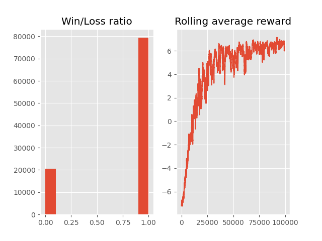

# Simple implementation of Reinforcement Learning

## TicTacToe Game

I first build a simple tictactoe game, on a 3x3 board, where a player input an x and y to marks a place. Then a bot will place a marks randomly
on an empty space.  
The marks are noted as 1 for the player, 2 for the bot, and 0s are empty space. 
If the player put a mark on an already marked spot, it will results in an illegal move and the game will be lost.

## Reinforcement learning

### Q table

The q table is a dictionnary with 19,683 keys, one for every state possible of the game. 
The values for each key is a vector of dimesnion 9, one for every action possible. The q value are initialized randomly.

### Rewards

The reward are shaped as follow:
- +10 for winning
- -10 for lossing
- -1 for taking an action
- -5 for an illegal move

### Bellman equation

To solve this environment we will use the bellman equation to udpate the Q value for a given state  
At each step, we will update the Q value, based on the new state of the game, the reward given by the step  
and the Q value of the previous step.  

<pre><code>new_q = (1 - LEARNING_RATE) * current_q + LEARNING_RATE*(reward + DISCOUNT*max_futur_q)
</code></pre>

### Training the agent

As the q table is rather large, we will need a high number of episode, number of time the game will be play
and using both exploration and exploitation to find an optimal way of winning the game. 
We will use a exploration value : γ = 0.95 and a decay of 0.999. While maintaining a minimun γ = 0.05
to still have a minimun 5% chance of testing new move for each step.

With hundred thousand of episode to train, our agent start to have good results.

## Results

After training for hundred thousand of episode the agent is able to win 96% of the time. 
The agent, q_table is saved in a pickle file. 
To load the agent :
<pre><code>with open("q_table.pkl", "rb") as f:
    q_table = pickle.load(f)
</code></pre>

Simple loop to run a game and have vizualisation :  
<pre><code>from game import Game
import pickle
from rl_agent import get_action
import numpy as np
import matplotlib.pyplot as plt

with open("q_table.pkl", "rb") as f:
    q_table = pickle.load(f)

total_win = 0
for ep in range(1):
    total_reward = 0
    env = Game()
    state = tuple(env.board.flatten())
    done = False
    while not done:
        n = np.argmax(q_table[state])
        action = get_action(n)
        illegal,new_state = env.move(*action)
        plt.imshow(env.board,cmap="gray")
        plt.axis('off')
        plt.show()
        plt.close()
        done, reward, win = env.game_state()
        if illegal:
            done = True

        state=new_state
        total_reward += reward
    if win:
        total_win+=1</code></pre>

The visualisation is done using matplotlib. So this will display one image per step, where black square is empty space, grey is the square of the agent and white would be the squate of the bot.

## Further improvement

As the bot make random move, we could train our agent by playing against himself. But due to the simplicity of the Tictactoe game this will mostly end in a draw for each game. As a draw will end up having a higher reward than a loss. And a draw is really simple to get in Tictactoe. 

A better visualisation of the game could be an improvement as of now this is not really intuitive.
